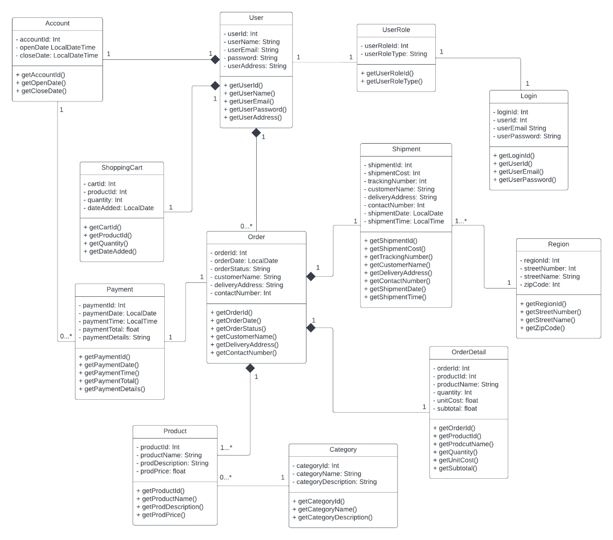

#Online Shopping System

---
#Overview

---
Online shopping is a form of electronic commerce which 
allows consumers to directly buy goods or services from a 
seller over the Internet using a web browser or a mobile app. 
It  also allows users to get goods delivered to their doorsteps.
---
#Domain Model

---

